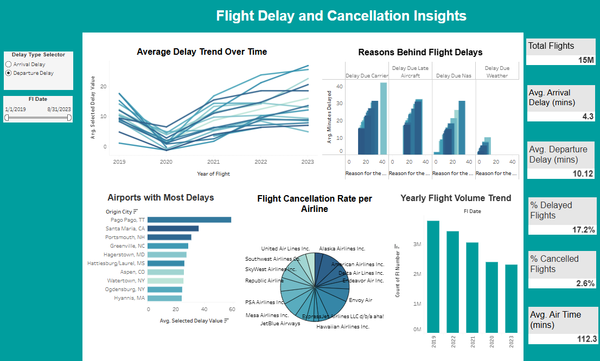

# Harnessing Machine Learning for Flight Status Prediction

## Project Overview
This project leverages machine learning techniques to predict flight delays using a comprehensive dataset spanning 2019 to 2023. The aim is to provide actionable insights for airlines and passengers, improving operational efficiency and decision-making.

## Dataset
- **Source**: Airline and government records.
- **Size**: 3 million entries.
- **Features**: Detailed flight information, including schedules, delays, distances, and airline-specific details.

## Objectives
- Develop predictive models for classifying flight status as either delayed or on time.
- Identify significant predictors influencing flight delays.
- Enhance decision-making in airline operations and customer communication.

## Models Implemented
### 1. Logistic Regression
- **Accuracy**: ~99.999%.
- **Key Predictor**: Departure delay (`DEP_DELAY`).
- Achieved perfect precision and recall.

### 2. XGBoost
- **Accuracy**: ~99.11%.
- Focuses on operational factors such as departure and taxi times.
- Handles large datasets efficiently.

## Key Findings
- Departure delay and taxi-out time are the most influential predictors of flight delays.
- Temporal and distance-based features have minimal impact on delay predictions.
- Both models offer robust performance, with logistic regression excelling in interpretability and XGBoost in handling complex patterns.

## Tools and Libraries
- **Programming Language**: Python
- **Libraries**:
  - Data Analysis: Pandas, NumPy
  - Visualization: Matplotlib, Seaborn
  - Modeling: Scikit-learn, XGBoost, Statsmodels

## Flight Delay Dashboard

## ✈️ Overview

This dashboard provides a **comprehensive analysis of flight delays and cancellations** based on historical data from **2019 to 2023**.  
It includes insights into **delay trends, cancellation rates, flight volume patterns**, and **key disruption metrics**.

The dashboard is designed to help users identify **patterns, root causes, and high-impact airports or airlines** contributing to flight disruptions.

---

## 🔑 Key Features

- **📈 Average Delay Trend Over Time**  
  Visualizes the trend of **average arrival and departure delays** from 2019 to 2023.

- **🛠️ Reasons Behind Flight Delays**  
  Breaks down delays by categories such as **Carrier**, **Late Aircraft**, **NAS (National Aviation System)**, and **Weather**.

- **🛫 Airports with Most Delays**  
  Highlights top airports (e.g., **Pago Pago, TT**; **Santa Maria, CA**) with the highest occurrences of delays.

- **🚫 Flight Cancellation Rate per Airline**  
  Displays the **cancellation rate distribution** across major airlines like **United Airlines**, **Southwest Airlines**, and **Delta Airlines**.

- **📅 Yearly Flight Volume Trend**  
  Shows the overall trend in **flight volume from 2019 to 2023**.

- **📊 Key Metrics Dashboard**  
  - **Total Flights**: 15 Million  
  - **Average Arrival Delay**: 4.3 minutes  
  - **Average Departure Delay**: 10.12 minutes  
  - **% of Delayed Flights**: 17.2%  
  - **% of Cancelled Flights**: 2.6%  
  - **Average Air Time**: 112.3 minutes
